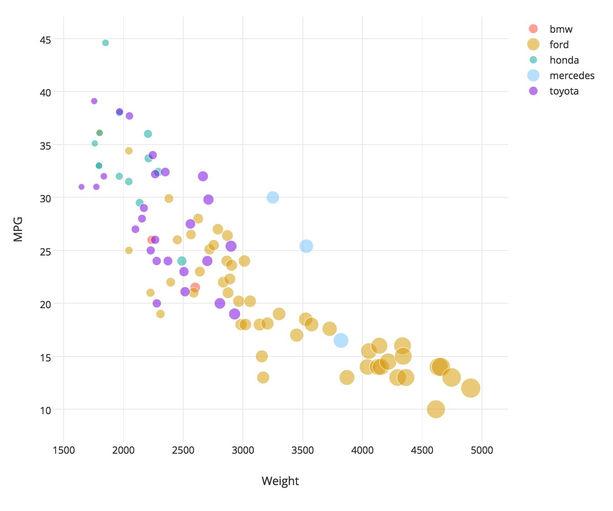

# 02-DataVis-10ways

By Congyang Wang --- 2017/01/17

*Assignment 2: This is my first work of WPI CS573 Data Visualization, in A1, I used D3.js and JavaScript to draw shapes, made interactive motion like drag, then submitted the work through github and deployed this to github page.*

* [1. D3.js](##_1._D3.js)
* [2. R + ggplot2](#2. R + ggplot2)

## 1. D3.js
- **Screenshots:**  

- **Note:**
Write a paragraph for each visualization tool you use. What was easy?Difficult? Where could you see the tool being useful in the future? Did you have to use any hacks or data manipulation to get the right chart?
http://bl.ocks.org/weiglemc/6185069
http://matthewgladney.com/blog/data-science/no-nonsense-guide-getting-started-scatter-plots-d3-js-d3-csv/
- **Technical and Design achievements:**
XXX

2. R + ggplot2
---
- **Screenshots:**  

R is a language primarily focused on statistical computing.
ggplot2 is a popular library for charting in R.
R Markdown is a document format that compiles to HTML or PDF and allows you to include the output of R code directly in the document.
# cc
To visualized the cars dataset, I made use of ggplot2's `geom_point()` layer, with aesthetics functions for the color and size.

While it takes time to find the correct documentation, these functions made the effort creating this chart minimal.

http://www.cnblogs.com/muchen/p/5412278.html
http://docs.ggplot2.org/0.9.3/qplot.html
http://rpubs.com/coyawa/cs573-a2r

## Excel

- **Screenshots:**  

- **Note:**
Write a paragraph for each visualization tool you use. What was easy?Difficult? Where could you see the tool being useful in the future? Did you have to use any hacks or data manipulation to get the right chart?
首先，在excel中其实是用了气泡图的功能，而不是散点图，如果已经做了一次，那么以后都很难会忘记，这是excel的好处，而且因为excel是最为普遍安装的办公软件，学习成本非常的低。但不好的方面，对于不同的颜色需要用系列function来完成，不能自动生成，bubble的点的面积也只能统一调整大小比例，和tableau差了不少。
Embed Link: https://www.zhihu.com/question/21032715
- **Technical and Design achievements:**
XXX

## Tableau

- **Screenshots:**  

- **Note:**
Tableau is a dedicated tool to make a visualization, for starter they can use the drag & drop to make a beautiful figure, for expert they can programming to make more tuning on the data and figure. When you have a clean and small dataset stored in .csv or .xls and so on, the Tableau is a good tool to use for analysis. This is my first time to make a scatter plot with tableau, I only met one question is how to show the scatters on the canvas, I youtube that, and make it done.
I give up two 'null' and one weight over 5000 all three records to get the right chart
Embed Link: https://public.tableau.com/views/573A2-Tableau/Sheet1?:embed=y&:display_count=yes

- **Technical and Design achievements:**
XXX
https://onlinehelp.tableau.com/current/pro/desktop/en-us/buildexamples_scatter.html
https://www.youtube.com/watch?v=72E8-FPHenc

## Python+Plot.ly

- **Screenshots:**  

- **Note:**
Write a paragraph for each visualization tool you use. What was easy?Difficult? Where could you see the tool being useful in the future? Did you have to use any hacks or data manipulation to get the right chart?

https://plot.ly/~wangcongyang/16/mpg-vs-weight/
https://plot.ly/python/bubble-charts/#new-to-plotly
- **Technical and Design achievements:**
XXX

## ECharts

- **Screenshots:**  

- **Note:**
Write a paragraph for each visualization tool you use. What was easy?Difficult? Where could you see the tool being useful in the future? Did you have to use any hacks or data manipulation to get the right chart?  
http://tushuo.baidu.com/p.php?p=dta8pgkhf36qf40k8
- **Technical and Design achievements:**
XXX

## Matlab

- **Screenshots:**  

- **Note:**
Write a paragraph for each visualization tool you use. What was easy?Difficult? Where could you see the tool being useful in the future? Did you have to use any hacks or data manipulation to get the right chart?

- **Technical and Design achievements:**
XXX

## Quadrigram

- **Screenshots:**  

- **Note:**
Write a paragraph for each visualization tool you use. What was easy?Difficult? Where could you see the tool being useful in the future? Did you have to use any hacks or data manipulation to get the right chart?

http://www.quadrigram.com/hosting/%E5%B0%8F%E4%BB%8E%E4%BB%8E/a2/#p/Page1
- **Technical and Design achievements:**
XXX

## Python+Bokeh

- **Screenshots:**  

- **Note:**
Write a paragraph for each visualization tool you use. What was easy?Difficult? Where could you see the tool being useful in the future? Did you have to use any hacks or data manipulation to get the right chart?  
http://bokeh.pydata.org/en/latest/docs/user_guide.html#userguide
- **Technical and Design achievements:**
XXX

## Visualizefree

- **Screenshots:**  

- **Note:**
Write a paragraph for each visualization tool you use. What was easy?Difficult? Where could you see the tool being useful in the future? Did you have to use any hacks or data manipulation to get the right chart?

- **Technical and Design achievements:**
XXX


